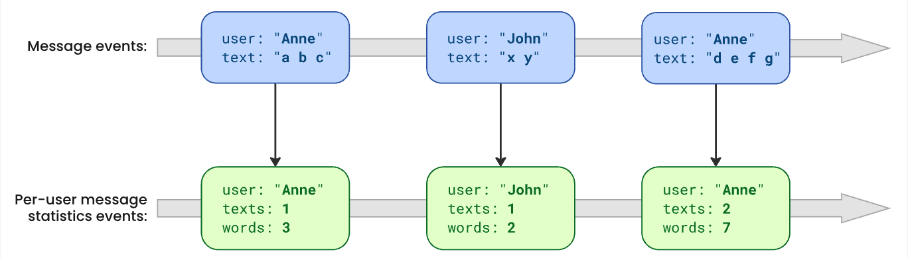

# About
This project demonstrates the accumulation of message data using a Pulsar Function.

The project consists of three applications:
* a **producer**, which
    * periodically creates randomized messages and
    * sends them as JSON messages to topic `messages`.
* a **function** to be deployed to Pulsar, which
    * consumes message JSON events from topic `messages`
    * transforms them to Java objects using Jackson,
    * accumulates message data (#texts, #words) per userId,
    * stores the accumulated values in Pulsar's (better: BookKeeper's) persistent state store, and
    * outputs accumulated events as JSON messages to topic `message-stats`.
* a **consumer**, which
    * consumes JSON events from both topics,
    * transforms them to Java objects using Jackson, and
    * outputs the received objects to the log.



# Building
```shell
mvn clean package
```

# Pulsar Setup
You need a Pulsar 4.x installation on localhost, see https://pulsar.apache.org/docs/en/standalone/.

```shell
cd <pulsar-installation>
PULSAR_STANDALONE_USE_ZOOKEEPER=1 bin/pulsar standalone
```
Note that without `PULSAR_STANDALONE_USE_ZOOKEEPER=1`, Pulsar starts a simplified standalone configuration,
which does not enable the Bookkeeper table service, and therefore cannot store function state
([PIP-117](https://github.com/apache/pulsar/issues/13302)).

In another shell tab, deploy the Pulsar Function that has been just built and packaged:
```shell
bin/pulsar-admin functions localrun \
  --jar $PD/function/target/function-0.1.0-SNAPSHOT-jar-with-dependencies.jar \
  --function-config-file $PD/function/function-config.yml \
  --stateStorageServiceUrl bk://127.0.0.1:4181
```
Where `$PD` is the path of this project.

Yet in another shell tab, you can observe the function log:
```shell
tail -f logs/functions/public/default/MessageFunction/MessageFunction-0.log
```

# Running
## Run Consumer
```shell
mvn -pl consumer spring-boot:run
```
Once the first message events are sent, you should see both the original messages and the message stats printed on the console.

## Run Producer
```shell
mvn -pl consumer spring-boot:run
```
Alternatively, both applications can be started from your IDE (e.g. as IntelliJ services).

## Cleanup
There are several ways to clean the topics:
* Either stop Pulsar and then clean everything:
  ```shell
  cd <pulsar-installation>
  rm -fr data logs
  ```
* Or delete the topics:
  ```shell
  bin/pulsar-admin topics delete messages
  bin/pulsar-admin topics delete message-stats
  ```
Note that the latter variant retains the function state (i.e. message stats). 